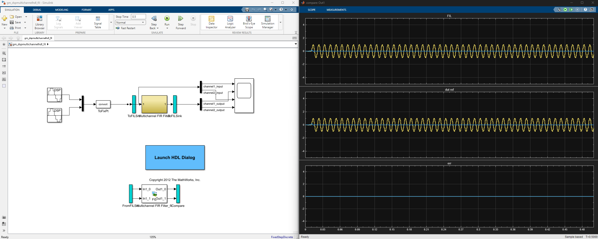

# HDL Coder: FPGA-in-the-loop
This demo shows how FPGA-in-the-loop profiling works.

## Hardware
- Artix-7 35T Arty FPGA Evaluation Kit

## Overview

If using JTAG, don't need to make any config externally (on the board).

PLEASE RMB TO FREAKING LOAD THE .BIT FILE IN THE GENERATED MODEL

## More info:
https://www.mathworks.com/help/dsp/ug/generate-hdl-code-for-multichannel-fir-filter.html
