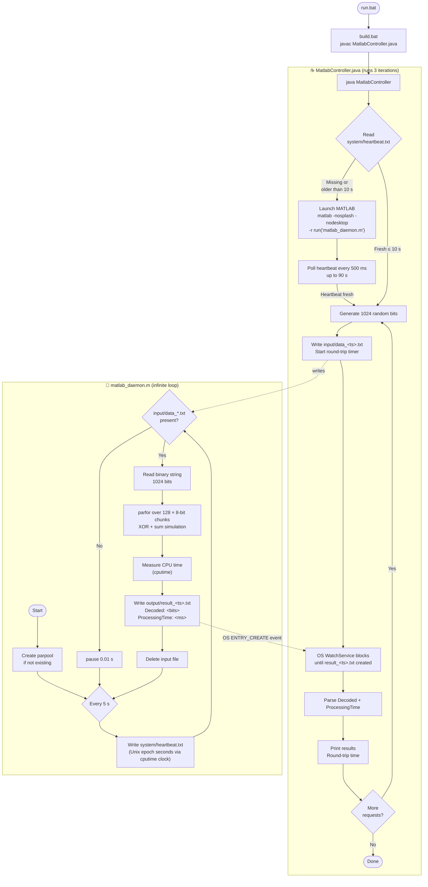

# Java ↔ MATLAB Persistent IPC Demo

A proof-of-concept demonstrating a **daemon-style MATLAB process** controlled by Java via the filesystem.

---

## Folder Structure

```
C:\demo\java_matlab\
├── input\                  ← Java writes data_<ts>.txt here
├── output\                 ← MATLAB writes result_<ts>.txt here
├── system\                 ← MATLAB writes heartbeat.txt here
├── matlab_daemon.m         ← MATLAB daemon script
├── MatlabController.java   ← Java controller
├── MatlabController.class  ← Compiled Java bytecode
├── build.bat               ← Compile: javac MatlabController.java
└── run.bat                 ← Build + run the demo
```

---

## How to Run

> **Prerequisite:** MATLAB with the Parallel Computing Toolbox must be on your `PATH`.

```bat
cd C:\demo\java_matlab
run.bat
```

On the **first run**, MATLAB opens in a separate window and creates a parallel pool (~30–60 s).  
On **subsequent runs**, Java detects the live heartbeat and reuses the daemon immediately.

---

## Flow Diagram



---

## IPC File Formats

### `input/data_<timestamp>.txt`
```
10110010110010001100101...   ← 1024 characters, 0 or 1
```

### `output/result_<timestamp>.txt`
```
Decoded:10110010110010001100101...
ProcessingTime:122.5900
```

### `system/heartbeat.txt`
```
1740276600   ← Unix epoch seconds, refreshed every 5 s by MATLAB
```

---

## Key Design Points

| Concern | Mechanism |
|---|---|
| MATLAB lifecycle detection | `heartbeat.txt` — stale if > 10 s old |
| Request/response matching | Shared `<timestamp>` token in filenames |
| Parallel processing | `parfor` over 8-bit chunks with XOR simulation |
| CPU timing | `cputime` in MATLAB (reflects actual CPU consumption) |
| Java result waiting | `WatchService.poll()` — OS notifies Java instantly on file creation, no sleep loop |
| Java round-trip timing | `System.currentTimeMillis()` before write → after watch event |
