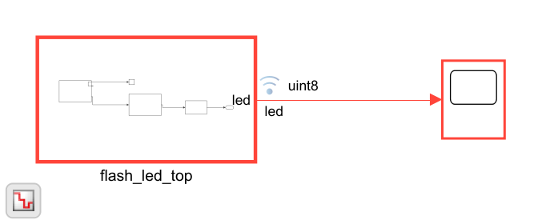

# LED Running Lights on the Digilent Arty A7-35T — two workflows

> The same 8-bit **"running light"** design implemented two ways on the Digilent **Arty A7-35T** (Artix-7 `xc7a35ticsg324-1L`): once as **hand-written VHDL** through AMD Vivado, and once **model-based** in Simulink with VHDL produced by MathWorks **HDL Coder**. Both build to a bitstream and drive the same eight on-board LEDs identically.

<p align="center">
  
</p>

## What it does

A single lit LED sweeps across the eight LEDs and wraps around — a classic "Knight Rider" running light.

- A **clock divider** counts the 100 MHz board clock and emits a one-cycle `tick` every 5,000,000 cycles (**20 Hz**, one full 8-LED sweep every 0.4 s).
- On each `tick` a **rotate-left** shifts the single lit bit of an 8-bit one-hot pattern (`00000001 → 00000010 → … → 10000000 →` wrap).
- Pressing push button **BTN0** resets the pattern back to LED0.

The two implementations are bit-for-bit equivalent: same clock divider, same registered `tick`, same rotate-left pattern.

## Repository layout

```
.
├── AMD/            Hand-written VHDL, built with AMD Vivado 2024.1
│   ├── lab1_flash_led.xpr                     Vivado project
│   └── lab1_flash_led.srcs/
│       ├── sources_1/new/counter.vhd          clock divider → tick
│       ├── sources_1/new/flash_led_ctl.vhd    rotate-left one-hot pattern
│       ├── sources_1/new/flash_led_top.vhd    top level
│       ├── sim_1/new/flash_led_top_tb.vhd     VHDL testbench
│       └── constrs_1/new/flash_led_top.xdc    pin constraints
│
├── MathWorks/      Model-based, Simulink + HDL Coder
│   ├── flash_led.slx                          Simulink model (DUT: flash_led_top)
│   ├── flash_led_arty_guide.mlx               step-by-step Live Script (start here)
│   ├── arty_custom_board/                     optional: register the Arty as a custom board
│   │   └── README.md
│   ├── hdl_prj/hdlsrc/                         VHDL generated by HDL Coder
│   └── docs/images/                           screenshots used by the guide
│
└── FFT_Comparison/ Why model-based? — the same FFT hand-written vs one block
    ├── AMD/                                    hand-written 8-point FFT + VHDL testbench
    ├── MathWorks/                              one FFT block -> 4,456 lines of generated VHDL
    └── README.md
```

## Requirements

| | AMD workflow | MathWorks workflow |
|---|---|---|
| Board | Digilent Arty A7-35T (`xc7a35ticsg324-1L`) | same |
| Tools | AMD Vivado 2024.1 | MATLAB R2026a (Simulink, HDL Coder, Fixed-Point Designer) + Vivado 2024.1 |
| Entry | Hand-written VHDL | Simulink model → generated VHDL |

Both workflows target Vivado 2024.1; adjust the tool path if yours differs.

---

## AMD workflow — hand-written VHDL

The `AMD/` folder is a complete Vivado project. The design is three small VHDL files plus a testbench and a constraints file.

**Build and program (Vivado GUI):**
1. Open `AMD/lab1_flash_led.xpr` in Vivado 2024.1.
2. (Optional) **Run Simulation** to exercise `flash_led_top_tb.vhd`.
3. **Generate Bitstream** (runs synthesis + implementation).
4. **Open Hardware Manager → Open Target → Auto Connect**, then right-click the device → **Program Device** with `flash_led_top.bit`.

**Build and program (Tcl):**
```tcl
open_project AMD/lab1_flash_led.xpr
launch_runs impl_1 -to_step write_bitstream -jobs 8
wait_on_run impl_1
open_hw_manager ; connect_hw_server ; open_hw_target
set dev [lindex [get_hw_devices xc7a35t*] 0]
set_property PROGRAM.FILE [get_property DIRECTORY [get_runs impl_1]]/flash_led_top.bit $dev
program_hw_devices $dev
```

---

## MathWorks workflow — model-based (Simulink + HDL Coder)

The design is captured in `MathWorks/flash_led.slx` and VHDL is produced by HDL Coder. **Start with the step-by-step Live Script:**

```
MathWorks/flash_led_arty_guide.mlx
```

It walks through the whole flow with screenshots: building the model, configuring HDL code generation, generating VHDL, creating the Vivado project from the HDL Workflow Advisor, assigning pins, generating the bitstream and programming the board. It also covers a common gotcha — removing HDL Coder's `clk_enable`/`ce_out` framework ports with **Minimize clock enables** — and switching the synthesis run out of out-of-context mode so a full bitstream builds.

**Optional — register the Arty as a custom board.** `MathWorks/arty_custom_board/` registers the Arty with HDL Coder so the **IP Core Generation** workflow generates the pin constraints from the board definition and programs the board as a workflow task (no manual XDC, no out-of-context fix). See [`MathWorks/arty_custom_board/README.md`](MathWorks/arty_custom_board/README.md).

---

## Pin mapping (shared)

Both workflows drive the same pins on the Arty A7-35T (all `LVCMOS33`):

| Signal | Pin | Board resource |
|---|---|---|
| `clk` | E3 | 100 MHz system clock |
| `rst` / `reset` | D9 | push button **BTN0** (active high) |
| `led[0..3]` | H5, J5, T9, T10 | green LEDs **LD4–LD7** |
| `led[4..7]` | F6, J4, J2, H6 | green channel of RGB LEDs **LD0–LD3** |

## Hand-written vs model-based, at a glance

| | AMD (hand-written) | MathWorks (model-based) |
|---|---|---|
| Design entry | VHDL | Simulink model |
| Verification | VHDL testbench + Vivado simulation | Simulink simulation |
| Pin constraints | manual XDC | manual XDC, or auto-generated from a custom board |
| Toolchain | Vivado | Simulink → HDL Coder → Vivado |
| Programming | Vivado Hardware Manager | HDL Workflow Advisor / Vivado Hardware Manager |

For the LED blinker the two approaches are close in effort. The payoff of the
model-based flow shows up on real DSP — see **[`FFT_Comparison/`](FFT_Comparison)**,
where the *same* 8-point FFT is ~160 lines of hand-written VHDL (8 points only)
versus one Simulink block that generates **4,456 lines** of production streaming
RTL, with both verified to produce the same spectrum.

---

## Notes for cloning / building

- Vivado and Simulink regenerate large build trees (`*.runs`, `*.sim`, `*.cache`, `slprj/`, `hdl_prj/vivado_prj/`, …). These are **not** tracked — see [`.gitignore`](.gitignore) — so a fresh clone contains only sources and the guide. Open the project/model and rebuild to regenerate them.
- Bitstreams live inside those regenerable build folders and are likewise not tracked.
